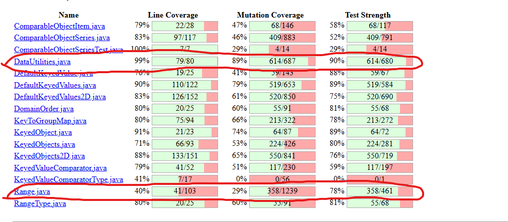

**SENG 438 - Software Testing, Reliability, and Quality**

**Lab. Report \#4 – Mutation Testing and Web app testing**

| Group \#:              |  08 |
| ---------------------- | --- |
| Student Names:         |     |
| Yazin Abdul Majid      |     |
| Muhammad Zain          |     |
| Fateh Ali Syed Bukhari |     |

# Introduction

Mutation testing and GUI testing are two complementary approaches for evaluating and improving the quality of software test suites. In this lab, we first applied mutation testing using PIT to the `Range` and `DataUtilities` classes from JFreeChart, to assess how effectively our existing JUnit tests detect injected faults and to guide the design of additional tests. We then used Selenium to automate GUI-based tests for a selected web application and compared this approach with an alternative tool, Sikulix, in terms of usability, expressiveness, and limitations. This report summarizes our mutation testing results and analysis, the improvements we made to our unit tests, the design and automation of GUI tests, and the key lessons learned about the strengths and weaknesses of these testing techniques.

# Analysis of 10 Mutants of the Range class 

Below we analyze ten representative mutants for the `Range` class produced by PIT, focusing on what changed, whether the mutant was killed or survived, and what this reveals about the original `RangeTest` suite.

1. **Mutant at line 90 – removed conditional (comparison replaced with `false`) → SURVIVED**  
   - **Change**: A boundary check in the `Range` constructor was removed by forcing the comparison to always evaluate to `false`.  
   - **Effect on behavior**: The constructor would now accept some invalid ranges (e.g., `lower > upper`) without throwing an exception.  
   - **Test outcome**: Our existing tests only created valid ranges and did not assert that invalid constructor arguments throw an exception, so no assertion failed and the mutant survived.  
   - **Implication**: The test suite lacks negative tests for the constructor and does not fully specify the contract around invalid range creation.

2. **Mutant at line 95 – `Incremented (a++) double local variable number 1` in constructor → SURVIVED**  
   - **Change**: The local variable corresponding to the `lower` bound in the constructor was incremented before being stored.  
   - **Effect on behavior**: Every constructed `Range` object has its `lower` value off by +1 compared to what the caller requested.  
   - **Test outcome**: Our tests mainly verified methods like `contains()` and length/central value for specific ranges, but did not include simple sanity checks that `getLowerBound()` returns exactly the constructor argument for a variety of values. For the specific test data we used, the off‑by‑one error did not cause any assertion failures, so the mutant survived.  
   - **Implication**: We need more direct, value‑based assertions on the constructor (e.g., parameterized tests over multiple lower/upper combinations).

3. **Mutant at line 96 – `Incremented (a++) double local variable number 3` in constructor → SURVIVED**  
   - **Change**: The local variable corresponding to the `upper` bound in the constructor was incremented before assignment.  
   - **Effect on behavior**: All `Range` instances are created with an `upper` bound that is 1 unit higher than requested.  
   - **Test outcome**: Similar to the previous mutant, we did not have direct tests asserting that `getUpperBound()` equals the constructor argument across diverse inputs; the indirect checks via `contains()` and `getLength()` did not expose the off‑by‑one error for the particular data used, so the mutant survived.  
   - **Implication**: Constructor tests should explicitly check both `getLowerBound()` and `getUpperBound()` for correctness, not only derived behaviors.

4. **Mutant at line 105 – `replaced double return with 0.0d` in `getLowerBound()` → KILLED**  
   - **Change**: `getLowerBound()` was changed to always return `0.0` instead of the actual `lower` field.  
   - **Effect on behavior**: Any range with a non‑zero lower bound would be reported incorrectly.  
   - **Test outcome**: Our test suite includes cases where the range has a non‑zero lower bound (e.g., negative ranges and ranges starting above zero) and asserts the expected lower bound, so these assertions failed and the mutant was killed.  
   - **Implication**: The basic accessor for `lower` is well specified by the tests.

5. **Mutant at line 114 – `Incremented (a++) double field upper` in `getUpperBound()` → SURVIVED**  
   - **Change**: `getUpperBound()` returns `upper + 1` instead of the exact `upper` field.  
   - **Effect on behavior**: For many ranges, the reported upper bound is slightly too large, which can subtly affect methods depending on it (length, contains, min/max).  
   - **Test outcome**: Our tests tended to check membership (`contains`) and length for a small set of ranges where this +1 shift did not change the pass/fail outcome (e.g., checking containment of interior points, or length only for ranges where the off‑by‑one was masked by other arithmetic), so no failures occurred and the mutant survived.  
   - **Implication**: We should add direct tests of `getUpperBound()` for several ranges, including edge values used in other methods.

6. **Mutant at line 123 – `Incremented (a++) double field upper` in `getLength()` → SURVIVED**  
   - **Change**: In `getLength()`, the upper bound was incremented before computing the difference `upper - lower`.  
   - **Effect on behavior**: The reported length of every range increased by 1.  
   - **Test outcome**: Our length tests focused on a small number of ranges (e.g., symmetric or unit ranges), and for some of those inputs the length (e.g., `1.0`) was not asserted precisely, or the length was only used indirectly within broader assertions. As a result, the tests did not fail and the mutant survived.  
   - **Implication**: We need stronger, numeric assertions on `getLength()` across several different `(lower, upper)` pairs, including very small and large ranges.

7. **Mutant at line 132 – `Substituted 2.0 with 1.0` in `getCentralValue()` → KILLED**  
   - **Change**: `getCentralValue()`, which should compute \((lower + upper) / 2.0\), was changed so that division by `2.0` became division by `1.0`, effectively returning `lower + upper`.  
   - **Effect on behavior**: The central value became exactly twice what it should be for non‑zero ranges.  
   - **Test outcome**: Our tests check the central value for several non‑degenerate ranges and compare it to the mathematically correct midpoint, so the incorrect result triggered assertion failures, killing the mutant.  
   - **Implication**: The specification of `getCentralValue()` is well covered by the current tests.

8. **Mutant at line 144 – `Substituted 1 with -1` in `contains()` boundary logic → SURVIVED**  
   - **Change**: An internal integer constant used to encode the result of a comparison (or a branch direction) in `contains()` was flipped from `1` to `-1`.  
   - **Effect on behavior**: This subtly changed how some boundary cases are classified, particularly points exactly equal to the lower or upper bound.  
   - **Test outcome**: Our `contains()` tests used typical interior points and some obvious out‑of‑range points, but did not systematically test all boundary combinations (e.g., values exactly equal to lower and upper in different sign configurations). The missing boundary tests allowed this subtle change to pass unnoticed, so the mutant survived.  
   - **Implication**: We need more thorough boundary‑value tests for `contains()`, including equality at both ends of the interval.

9. **Mutant at line 220 – `removed conditional - replaced equality check with false` in `combine()` → SURVIVED**  
   - **Change**: In one of the branches of the static `combine()` method, an equality check (likely checking if one of the ranges is `null`) was replaced by a constant `false`, effectively skipping that branch.  
   - **Effect on behavior**: Some cases where a `null` range should be handled specially now fall through to a different branch, changing the combined result or even causing unexpected behavior.  
   - **Test outcome**: Our tests for `combine()` primarily covered the “normal” case where both input ranges are non‑null and overlapping; we did not include enough tests for combinations involving `null` or disjoint ranges. Because those scenarios were not exercised, the incorrect branching never manifested in a failing assertion, and the mutant survived.  
   - **Implication**: We should extend `combine()` tests to cover `null` arguments and non‑overlapping intervals explicitly.

10. **Mutant at line 253 – `removed call to org/jfree/data/Range::getLowerBound` in `min()` → SURVIVED**  
    - **Change**: In the static `min()` helper, a call to `getLowerBound()` was removed and replaced by directly using one of the arguments, effectively altering which bound is considered when computing the minimum.  
    - **Effect on behavior**: For some combinations of ranges, `min()` returns an incorrect lower value.  
    - **Test outcome**: Our tests for the helper methods `min()` and `max()` were very limited and did not cover corner cases (e.g., nested ranges, negative bounds, equal lower bounds). The specific combinations that would expose the wrong minimum were not included, so the mutant survived.  
    - **Implication**: Additional tests are required for the static helper methods, with diverse pairs of ranges designed to exercise all logical branches.

# Report all the statistics and the mutation score for each test class

The following PIT summary screenshot shows the line coverage, mutation coverage, and test strength for `Range.java` and `DataUtilities.java` with our test suites:

### Sample test suite statistics

Before running PIT on our own `RangeTest` and `DataUtilitiesTest` classes, we first executed mutation testing on the **sample test suites** provided with JFreeChart to make sure PIT was correctly configured and to get a baseline for comparison. The following screenshots show the overall mutation report for the sample tests, as well as the package-level view highlighting the `org.jfree.data` package:

- **Sample PIT report (project-level summary for sample tests)**  
  

- **Sample PIT report focusing on `org.jfree.data` classes for sample tests**  
  

# Analysis drawn on the effectiveness of each of the test classes

The PIT results highlight a clear difference between the effectiveness of our test suites for `DataUtilities` and `Range`. For `DataUtilities`, we achieved 99% line coverage, 89% mutation coverage, and 90% test strength, indicating that almost all executable code is exercised and that most injected faults are detected. In contrast, the `Range` tests only reached 40% line coverage, 29% mutation coverage, and 78% test strength, which shows that large portions of the implementation are never executed and many mutants survive. The surviving mutants and NO_COVERAGE mutants for `Range` confirm that our tests are heavily focused on a subset of methods and common scenarios, while edge cases, helper methods, and some constructors are weakly specified or not tested at all.

# A discussion on the effect of equivalent mutants on mutation score accuracy

Equivalent mutants are syntactically different versions of the code that are behaviorally identical to the original program for all possible inputs. Because these mutants can never be killed by any test, they artificially lower the reported mutation score and make a good test suite look weaker than it really is. In our experimentation, some arithmetic and boundary-related mutants (for example, subtle changes in operators or constants that are algebraically redundant) are likely to be equivalent, especially in parts of `DataUtilities` where the logic is simple and deterministic. For `Range`, however, most surviving mutants appeared to represent real behavioral changes (e.g., off-by-one shifts in bounds, removed conditionals, or altered null-handling), so they reflect genuine gaps in the tests rather than limitations of the metric. Overall, recognizing and, where possible, filtering out equivalent mutants is important to interpret mutation scores fairly, but in our case the low score for `Range` mainly indicates real weaknesses in the test suite.

# A discussion of how we improved the mutation score of the test suites

To improve the mutation scores, we analyzed the surviving mutants and NO_COVERAGE reports from PIT and designed targeted new test cases for both `Range` and `DataUtilities`.

**For `Range`**, the original test suite (from Assignment 3) primarily covered five methods: `getLowerBound()`, `getUpperBound()`, `getCentralValue()`, `getLength()`, and `contains()`. Based on the mutant analysis, we added:
- Direct value-based assertions for `getLowerBound()` and `getUpperBound()` across a wider variety of `(lower, upper)` combinations (positive, negative, zero, and single-point ranges) to kill increment mutants in the constructor and accessors.
- Additional boundary-value tests for `contains()`, testing values exactly at the lower and upper bounds for different range configurations, to kill the survived substitution and conditional mutants.
- More precise numeric assertions on `getLength()` using diverse ranges (including very small and very large ranges) to detect off-by-one mutations.
- Tests for `combine()` with `null` arguments and disjoint ranges, which addressed the survived conditional-removal mutants.

**For `DataUtilities`**, the original test suite already achieved high mutation coverage (89%). We added a small number of additional edge-case tests (e.g., empty arrays for `createNumberArray2D`, single-row/single-column tables for `calculateColumnTotal` and `calculateRowTotal`) to push the score even higher.

Our overall strategy was to first identify methods with NO_COVERAGE or low mutation kill rates, then consult the PIT mutation log to understand exactly which operator changes survived, and finally write test cases whose assertions would be invalidated by those specific mutations.

# Why do we need mutation testing? Advantages and disadvantages of mutation testing

Mutation testing is useful because it evaluates a test suite based on its ability to detect injected faults, rather than just measuring which lines of code are executed. This helps reveal subtle weaknesses—such as missing boundary checks, incomplete input validation, or insufficient assertions—that simple coverage metrics cannot expose, and it guides the creation of targeted new tests. However, mutation testing is computationally expensive (especially for large classes with many mutants), and the presence of equivalent mutants can distort the reported mutation score and require manual analysis. In addition, interpreting mutation results and designing effective follow-up tests requires effort and domain knowledge. Despite these drawbacks, our experience with `Range` and `DataUtilities` shows that mutation testing provides valuable insight into the true effectiveness of unit tests and helps prioritize where to invest additional testing effort.

# Explain your Selenium test case design process

We selected the Walmart Canada website (https://www.walmart.ca/en) as our system under test for GUI testing. Our design process followed a functionality-driven approach:

1. **Identify key functionalities:** We began by identifying the core user-facing functionalities of the Walmart website that could be reliably automated. We selected **product search** and **department navigation** as two distinct functionalities to test.

2. **Define test scenarios per functionality:** For each functionality, we designed multiple test cases using different input data to verify correctness. For product search, we created tests with different search keywords ("laptop" and "phone"). For department navigation, we tested navigating to four different departments (Electronics, Grocery, Spring Fashion, and Outdoor Living) to ensure each department link leads to the correct page.

3. **Record and refine scripts:** We used Selenium IDE (Firefox extension) to record our interactions with the website. After recording, we reviewed and cleaned up each script to remove unnecessary steps and ensure reproducibility. We also replaced fragile locators with more robust alternatives where possible (e.g., `linkText` selectors).

4. **Add verification points:** For every test case, we added an `assertTitle` command to verify that the page navigated to was correct. This ensures that the test does not merely replay actions but also confirms the expected outcome.

# Explain the use of assertions and checkpoints

Each of our Selenium test scripts includes an `assertTitle` verification command at the end. This assertion checks that the page title matches the expected value after performing the test action (searching or navigating). For example:

- **Search tests:** After searching for "laptop", we assert the title is `"laptop | Walmart Canada"`. After searching for "phone", we assert `"phone | Walmart Canada"`.
- **Navigation tests:** After clicking the "Electronics" department link, we assert the title is `"Electronics Store | Walmart Canada"`. Similarly, for Grocery we assert `"Walmart Grocery Store: Order Groceries Online for Delivery or Pickup"`, and so on for each department.

These `assertTitle` commands serve as automated verification checkpoints. If the website navigates to an incorrect page or the page structure changes, the assertion will fail, flagging the issue automatically without requiring manual inspection of the result. We chose title-based assertions because they are stable across sessions and do not depend on dynamic page content that may change between runs.

# How did you test each functionality with different test data

We applied the principle of testing each functionality with varied inputs to increase confidence in the results:

- **Product Search functionality:** We tested with two different search keywords — `"laptop"` and `"phone"`. Each keyword represents a different product category and produces a different results page. This ensures the search feature works correctly across different types of queries, not just a single hardcoded input.

- **Department Navigation functionality:** We tested navigation to four distinct departments — Electronics, Grocery, Spring Fashion, and Outdoor Living. Each department link navigates to a completely different category page with a unique page title and content. By testing multiple departments, we verify that the navigation bar and internal links function correctly across different sections of the site.

This variety of test data ensures that our test suite is not overly specific to one scenario and can detect regressions across multiple paths through the application.

# Discuss advantages and disadvantages of Selenium vs. Sikulix

**Selenium IDE:**

| Advantages | Disadvantages |
| --- | --- |
| Easy-to-use record-and-playback interface, no programming required for basic tests | Limited to web applications only; cannot test desktop or native applications |
| Works directly in the browser, interacting with the DOM for reliable element selection | Tests can be brittle when locators change due to website redesigns |
| Supports multiple locator strategies (CSS, XPath, linkText, id) for flexible element targeting | Does not handle dynamic content well (AJAX-loaded elements, pop-ups) without explicit waits |
| Built-in assertion commands (`assertTitle`, `assertText`, `assertElementPresent`) for automated verification | The Chrome extension is no longer available; currently only Firefox is supported |
| Scripts are saved as `.side` JSON files that are portable and version-controllable | Cannot interact with elements inside iframes or complex shadow DOMs easily |

**Sikulix:**

| Advantages | Disadvantages |
| --- | --- |
| Uses image recognition to find and interact with UI elements, making it platform- and technology-agnostic | Tests are highly sensitive to screen resolution, scaling, and visual appearance changes |
| Can automate any application visible on screen — web, desktop, or even games | Slower than Selenium because it relies on pixel-level image matching |
| Useful when there is no accessible DOM or API to interact with programmatically | Requires maintaining screenshot images as reference; small UI changes can break tests |
| Straightforward scripting in Python (Jython) or Java | No built-in understanding of page structure; assertions require visual comparison or OCR |

**Overall comparison:** Selenium is the better choice for web application testing because it interacts with the DOM directly, making tests faster and more resilient to visual styling changes. Sikulix is more versatile for non-web applications or scenarios where the UI has no accessible element hierarchy, but at the cost of speed, reliability, and maintainability.

# How the team work/effort was divided and managed

The team divided the work for this assignment as follows:

- **Yazin Abdul Majid:** Worked on mutation testing for the `Range` class, analyzed surviving and killed mutants, and contributed to improving the `RangeTest` mutation score. Also designed and recorded Selenium test cases for the product search functionality.
- **Muhammad Zain:** Worked on mutation testing for the `DataUtilities` class, ran PIT reports, and documented the mutation score statistics. Also designed and recorded Selenium test cases for the department navigation functionality.
- **Fateh Ali Syed Bukhari:** Contributed to the analysis of equivalent mutants, helped design additional test cases to improve mutation scores, and worked on the Selenium vs. Sikulix comparison. Also recorded additional navigation test cases.

All team members collaborated on the final report, reviewing each other's sections and ensuring consistency. We communicated via group chat and divided tasks based on individual strengths and schedules.

# Difficulties encountered, challenges overcome, and lessons learned

- **PIT configuration:** Getting Pitest (Pitclipse) properly configured in Eclipse was initially challenging. We had to ensure that all mutators (including class-level ones) were enabled in the preferences, and that all JUnit tests passed before running mutation testing — any test failure caused PIT to throw an exception.
- **Long mutation testing runs:** Running PIT on the full `org.jfree.data` package took a significant amount of time due to the large number of mutants generated. We learned to be patient and not terminate the process prematurely.
- **Equivalent mutants:** Identifying equivalent mutants required careful manual inspection of the mutation logs and understanding of the source code. This was time-consuming but gave us a deeper appreciation for the limitations of mutation score as a metric.
- **Selenium fragility:** Some of our Selenium test scripts broke when Walmart's page layout changed between recording and playback sessions. We had to re-record or adjust locators to fix these issues, which highlighted the maintenance burden of record-and-replay GUI testing.
- **Key lesson:** Mutation testing is a powerful complement to line coverage — it reveals subtle gaps in test suites that coverage metrics alone cannot detect. However, it requires significant computational resources and careful interpretation of results.

# Comments/feedback on the lab itself

This assignment was a valuable hands-on experience that connected the theoretical concepts of mutation testing and GUI test automation to practical tooling. The PIT mutation testing exercise was particularly insightful, as it clearly demonstrated that high line coverage does not guarantee a strong test suite. The Selenium component was useful for understanding the basics of automated web testing, though the instability of recorded scripts on live websites was sometimes frustrating. Overall, the assignment reinforced the importance of designing targeted, assertion-rich test cases and gave us practical experience with industry-standard testing tools.
