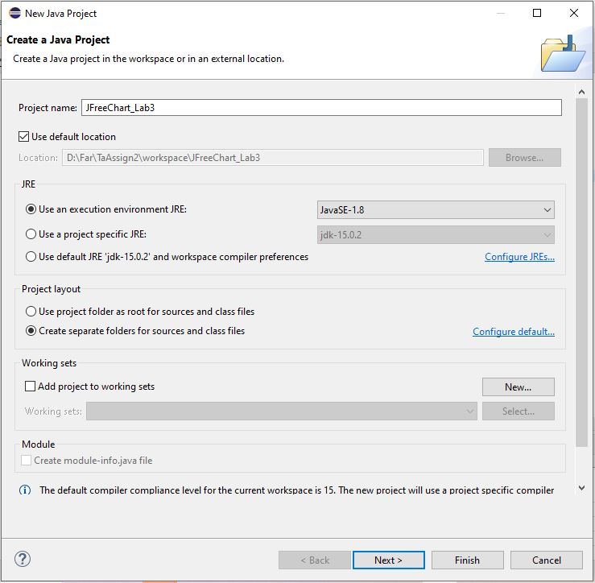
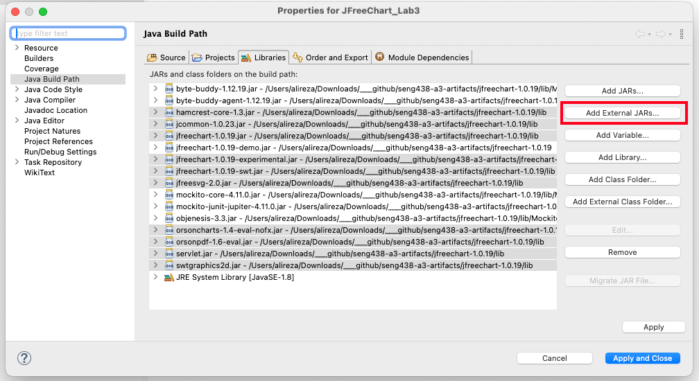
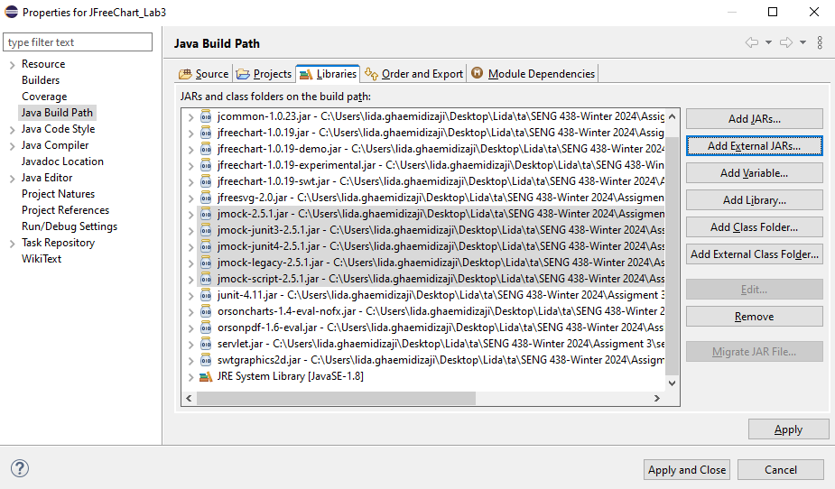
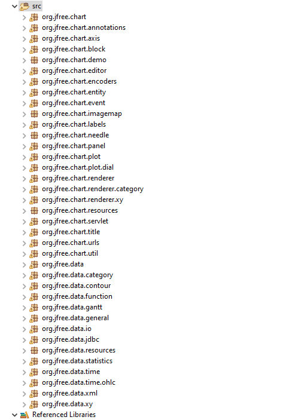
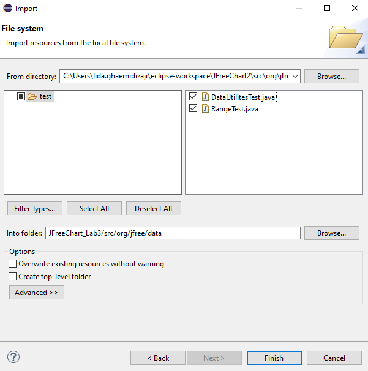
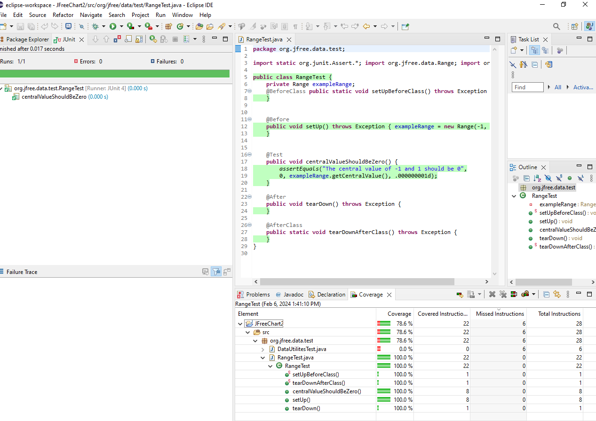
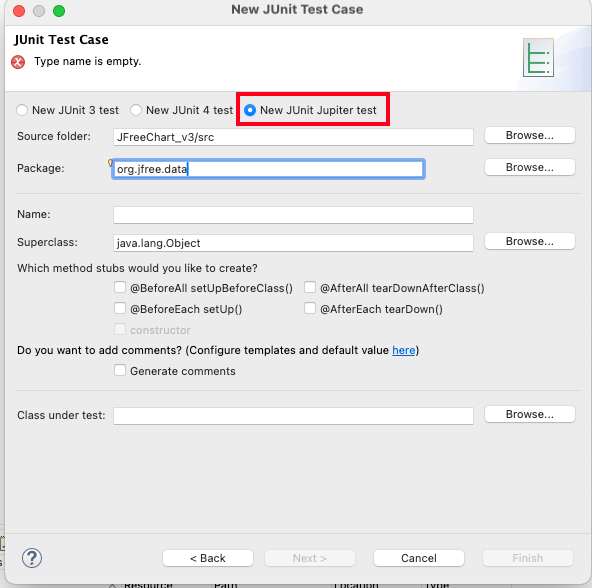

## **SENG 438 - Software Testing, Reliability, and Quality**

## **Lab Report #3 – Code Coverage, Adequacy Criteria and Test Case Correlation**

| Group #: | 08 |
|--------|----|
| Student Name 01 | Muhammad Zain |
| Student Name 02 | Fateh Ali Syed Bukhari |
| Student Name 03 | Yazin Abdul Majid |

---

# 1 Introduction

This lab builds directly on Assignment 2 by shifting the testing strategy from black-box (requirements-based) to white-box (coverage-based) testing. Where Assignment 2 relied solely on Javadoc specifications to derive test oracles, this assignment leverages the source code itself to evaluate test suite adequacy through control-flow and data-flow coverage metrics.

The system under test remains the same: `org.jfree.data.DataUtilities` and `org.jfree.data.Range` from the JFreeChart 1.0.19 library. These classes contain intentionally injected defects, meaning some tests are expected to fail even when correctly written against the specification.

The assignment is structured in three parts:

1. **Control-flow coverage measurement** — Using EclEmma inside Eclipse, we measure instruction (statement), branch, and method coverage of our Assignment 2 test suite against both classes and report the results in detail.
2. **Manual data-flow coverage** — We manually trace the execution of our existing test cases through two selected methods to compute DU-pair coverage by hand, without relying on any tool.
3. **Test suite enhancement** — We design new test cases guided by the coverage gaps identified in Part 1, targeting the minimums of 90% statement, 70% branch, and 60% condition coverage per class.

---

## 1.1 Project Setup

The following screenshots document the Eclipse project configuration used throughout this assignment.

**Step 1 — Create a new Java project** (`JFreeChart_Lab3`) in Eclipse targeting JavaSE-1.8:



**Step 2 — Configure the Java Build Path** by adding all required JARs (JFreeChart 1.0.19, JUnit Jupiter 4/5, Mockito, Hamcrest, etc.) via *Add External JARs*:





**Step 3 — Verify the source package structure** contains `org.jfree.data` (and all other JFreeChart packages) under `src`:



**Step 4 — Import test files** (`DataUtilitiesTest.java` and `RangeTest.java`) from the Assignment 2 workspace into `src/org/jfree/data`:



**Step 5 — Run tests with EclEmma** (Coverage As → JUnit Test) to confirm the baseline pass/fail count and inspect coverage metrics in the Coverage view:



**Step 6 — Create new JUnit Jupiter test cases** using Eclipse's *New → JUnit Test Case* wizard, selecting *New JUnit Jupiter test* and setting the package to `org.jfree.data`:



---

# 2 Manual Data-Flow Coverage Calculations for `DataUtilities.calculateColumnTotal` and `Range.contains`

The two methods selected for manual DU-pair coverage analysis are:
1. `DataUtilities.calculateColumnTotal(Values2D data, int column)` — mandatory per assignment instructions
2. `Range.contains(double value)` — chosen from the Range class because it is compact, has clear branching, and has extensive test coverage from Assignment 2

For each method we produce: (a) a control-flow graph, (b) def-use sets per statement, (c) all DU-pairs per variable, (d) per-test DU-pair coverage, and (e) the overall DU-pair coverage percentage.

> The control-flow diagram for both methods is shown once in Section 2.1.2 (*Figure 1*); Section 2.2.2 refers back to it (*Figure 2* = lower part of the same diagram).

---

## 2.1 `DataUtilities.calculateColumnTotal(Values2D data, int column)`

### 2.1.1 Annotated Source Code

The statements are labelled S1–S12 for use throughout this analysis. The second `for`-loop (S10–S11) is **dead code**: its condition `r2 > rowCount` is always `false` since `r2` initialises to `0` and `rowCount ≥ 0`.

```java
public static double calculateColumnTotal(Values2D data, int column) {
    /* S1  */ ParamChecks.nullNotPermitted(data, "data");
    /* S2  */ double total = 0.0;
    /* S3  */ int rowCount = data.getRowCount();
    /* S4  */ for (int r = 0;      // S4 = loop init:  r = 0
    /* S5  */          r < rowCount;   // S5 = loop cond:  r < rowCount  [predicate]
    /* S9  */          r++) {          // S9 = loop incr:  r++
    /* S6  */     Number n = data.getValue(r, column);
    /* S7  */     if (n != null) {                        // [predicate]
    /* S8  */         total += n.doubleValue();
                  }
               }
    // ── DEAD CODE (intentional bug: r2 > rowCount is always false) ──
    /* S10 */ for (int r2 = 0; r2 > rowCount; r2++) {    // S10 = init; S11 = cond
    /* S11 */     Number n = data.getValue(r2, column);   // never reached
                  if (n != null) { total += n.doubleValue(); }
               }
    // ─────────────────────────────────────────────────────────────────
    /* S12 */ return total;
}
```

---

### 2.1.2 Control-Flow Graph

**Figure 1** — Control-flow graph for `DataUtilities.calculateColumnTotal(Values2D data, int column)` (top) and `Range.contains(double value)` (bottom). DEF/USE annotations are shown on each node; the dead-code second loop (S10/S11) is highlighted.


*ASCII representation (for reference):*

```
  [ENTRY] data, column (parameters)
        |
       [S1] nullNotPermitted(data, "data")
        |
       [S2] total = 0.0
        |
       [S3] rowCount = data.getRowCount()
        |
       [S4] r = 0
        |
   ┌───[S5] r < rowCount? ───────────────────────┐
   │         │                                   │ (false)
   │       (true)                                │
   │         │                                [S10] r2 = 0  ← dead code
   │        [S6] n = data.getValue(r, column)  [S11] r2 > rowCount? → always FALSE
   │         │                                    │
   │        [S7] n != null?          ┌────────────┘ (immediately false)
   │        /       \                │
   │    (true)     (false)          [S12] return total
   │      /           \               │
   │    [S8]       (skip)          [EXIT]
   │  total += n.dV()
   │      \           /
   │       ──────────
   │            │
   │           [S9] r++
   └────────────┘  (back-edge to S5)
```

**CFG Edges (reachable):**
S1→S2, S2→S3, S3→S4, S4→S5, S5→S6 (true), S5→S10 (false), S6→S7, S7→S8 (true), S7→S9 (false), S8→S9, S9→S5 (back-edge), S10→S11, S11→S12 (always false, dead body), S12→EXIT

---

### 2.1.3 Def-Use Sets per Statement

| Node | Statement | DEF | USE (c-use) | USE (p-use) |
|------|-----------|-----|-------------|-------------|
| S1 | `nullNotPermitted(data, "data")` | — | data | — |
| S2 | `double total = 0.0` | total | — | — |
| S3 | `int rowCount = data.getRowCount()` | rowCount | data | — |
| S4 | `r = 0` (loop init) | r | — | — |
| S5 | `r < rowCount` (loop condition) | — | — | r, rowCount |
| S6 | `n = data.getValue(r, column)` | n | data, r, column | — |
| S7 | `if (n != null)` (predicate) | — | — | n |
| S8 | `total += n.doubleValue()` | total | total, n | — |
| S9 | `r++` (loop increment) | r | r | — |
| S10 | `r2 = 0` *(dead)* | r2 | — | — |
| S11 | `r2 > rowCount` *(dead – always false)* | — | — | r2, rowCount |
| S12 | `return total` | — | total | — |

---

### 2.1.4 All DU-Pairs per Variable

Only **feasible** DU-pairs are listed. DU-pairs entirely within the dead-code second loop are marked separately as infeasible and excluded from the coverage calculation.

| # | Variable | DEF at | USE at | Use Type | Feasible? | Notes |
|---|----------|--------|--------|----------|-----------|-------|
| 1 | `data` | param | S1 | c-use | ✅ | |
| 2 | `data` | param | S3 | c-use | ✅ | |
| 3 | `data` | param | S6 | c-use | ✅ | Only when first loop body executes |
| 4 | `column` | param | S6 | c-use | ✅ | Only when first loop body executes |
| 5 | `total` | S2 | S8 | c-use | ✅ | def-clear path: S2→…→S8 (first iter, n≠null) |
| 6 | `total` | S2 | S12 | c-use | ✅ | def-clear only when S8 never executes (rowCount=0 or all n null) |
| 7 | `total` | S8 | S8 | c-use | ✅ | S8 in iter k used by S8 in iter k+1 (multi-row, n≠null) |
| 8 | `total` | S8 | S12 | c-use | ✅ | last S8 execution to return |
| 9 | `rowCount` | S3 | S5 | p-use | ✅ | loop condition |
| 10 | `r` | S4 | S5 | p-use | ✅ | first loop-condition eval |
| 11 | `r` | S4 | S6 | c-use | ✅ | getValue(r, column) first call |
| 12 | `r` | S9 | S5 | p-use | ✅ | r++ → next condition eval |
| 13 | `r` | S9 | S6 | c-use | ✅ | r++ → getValue(r, column) next call |
| 14 | `n` | S6 | S7 | p-use | ✅ | null-check predicate |
| 15 | `n` | S6 | S8 | c-use | ✅ | n.doubleValue() when n≠null |
| — | `rowCount` | S3 | S11 | p-use | ❌ INFEASIBLE | dead loop: 0 > rowCount is always false |
| — | `r2` | S10 | S11 | p-use | ❌ INFEASIBLE | dead loop body never entered |

**Total feasible DU-pairs: 15**

---

### 2.1.5 DU-Pair Coverage per Test Case

Six representative test cases from `DataUtilitiesTest.java` are traced (others are omitted for brevity but covered pairs are subsets of those shown):

| DU# | Pair (DEF→USE) | T1 | T2 | T3 | T4 | T5 | T6 |
|-----|---------------|----|----|----|----|----|----|
| 1 | data(param)→S1 | ✓ | ✓ | ✓ | ✓ | ✓ | ✓ |
| 2 | data(param)→S3 | ✓ | ✓ | ✗ | ✓ | ✓ | ✓ |
| 3 | data(param)→S6 | ✓ | ✗ | ✗ | ✓ | ✗ | ✓ |
| 4 | column(param)→S6 | ✓ | ✗ | ✗ | ✓ | ✗ | ✓ |
| 5 | total(S2)→S8 | ✓ | ✗ | ✗ | ✓ | ✗ | ✓ |
| 6 | total(S2)→S12 | ✗ | ✓ | ✗ | ✗ | ✓ | ✗ |
| 7 | total(S8)→S8 | ✓ | ✗ | ✗ | ✗ | ✗ | ✓ |
| 8 | total(S8)→S12 | ✓ | ✗ | ✗ | ✓ | ✗ | ✓ |
| 9 | rowCount(S3)→S5 | ✓ | ✓ | ✗ | ✓ | ✓ | ✓ |
| 10 | r(S4)→S5 | ✓ | ✓ | ✗ | ✓ | ✓ | ✓ |
| 11 | r(S4)→S6 | ✓ | ✗ | ✗ | ✓ | ✗ | ✓ |
| 12 | r(S9)→S5 | ✓ | ✗ | ✗ | ✓ | ✗ | ✓ |
| 13 | r(S9)→S6 | ✓ | ✗ | ✗ | ✗ | ✗ | ✓ |
| 14 | n(S6)→S7 | ✓ | ✗ | ✗ | ✓ | ✗ | ✓ |
| 15 | n(S6)→S8 | ✓ | ✗ | ✗ | ✓ | ✗ | ✓ |
| | **Pairs covered** | **13** | **4** | **1** | **10** | **3** | **12** |

**Test case key:**

| ID | Test Method | Setup |
|----|-------------|-------|
| T1 | `calculateColumnTotal_validData_validColumn` | 3 rows, all non-null (1.0, 2.0, 3.0) |
| T2 | `calculateColumnTotal_invalidColumn_returnsZero` | rowCount = 0 |
| T3 | `calculateColumnTotal_nullData_throwsNullPointerException` | data = null (throws at S1) |
| T4 | `calculateColumnTotal_singleRow_returnsCorrectSum` | 1 row, value = 42.0 |
| T5 | `calculateColumnTotal_emptyTable_returnsZero` | rowCount = 0 |
| T6 | `calculateColumnTotal_nullValuesInColumn_treatsAsZero` | 3 rows: [5.0, null, 3.0] |

**Pair coverage per test (union across all 6 tests):**

| DU # | Covered by ≥ 1 test? |
|------|----------------------|
| 1 | ✅ (T1–T6) |
| 2 | ✅ (T1, T2, T4, T5, T6) |
| 3 | ✅ (T1, T4, T6) |
| 4 | ✅ (T1, T4, T6) |
| 5 | ✅ (T1, T4, T6) |
| 6 | ✅ (T2, T5) |
| 7 | ✅ (T1, T6) |
| 8 | ✅ (T1, T4, T6) |
| 9 | ✅ (T1, T2, T4, T5, T6) |
| 10 | ✅ (T1, T2, T4, T5, T6) |
| 11 | ✅ (T1, T4, T6) |
| 12 | ✅ (T1, T4, T6) |
| 13 | ✅ (T1, T6) |
| 14 | ✅ (T1, T4, T6) |
| 15 | ✅ (T1, T4, T6) |

---

### 2.1.6 DU-Pair Coverage Calculation

$$\text{DU-Pair Coverage} = \frac{\text{DU-pairs covered by at least one test}}{\text{Total feasible DU-pairs}} = \frac{15}{15} = \mathbf{100\%}$$

All 15 feasible DU-pairs are covered. The 2 infeasible pairs (in the dead-code second loop) are excluded from both numerator and denominator — they cannot be covered by any test because the loop condition `r2 > rowCount` is a permanent invariant violation (injected bug).

---

## 2.2 `Range.contains(double value)`

### 2.2.1 Annotated Source Code

```java
public boolean contains(double value) {
    /* S2 */ if (value < this.lower) {                              // [predicate]
    /* S3 */     return false;
             }
    /* S4 */ if (value > this.upper) {                              // [predicate]
    /* S5 */     return false;
             }
    /* S6 */ return (value >= this.lower && value <= this.upper);
}
```

`this.lower` and `this.upper` are instance fields defined in the constructor. They are treated as definitions available at method entry (equivalent to parameters for intra-procedural DU analysis).

---

### 2.2.2 Control-Flow Graph

**Figure 2** — Control-flow graph for `Range.contains(double value)` (lower section of **Figure 1** above). Entry state and DEF/USE for *value*, *lower*, and *upper* are shown. See the single control-flow diagram in Section 2.1.2.

*ASCII representation (for reference):*

```
  [ENTRY] value (param), this.lower, this.upper (fields)
        |
       [S2] value < this.lower?
       /                      \
   (true)                   (false)
     |                         |
   [S3] return false          [S4] value > this.upper?
     |                        /                   \
  [EXIT]                  (true)                (false)
                            |                     |
                          [S5] return false     [S6] return (value >= lower
                            |                        && value <= upper)
                         [EXIT]                     |
                                                 [EXIT]
```

**CFG Edges:**
Entry→S2, S2→S3 (true), S2→S4 (false), S3→EXIT, S4→S5 (true), S4→S6 (false), S5→EXIT, S6→EXIT

---

### 2.2.3 Def-Use Sets per Statement

| Node | Statement | DEF | USE (c-use) | USE (p-use) |
|------|-----------|-----|-------------|-------------|
| Entry | method entry | value, lower, upper (all available) | — | — |
| S2 | `if (value < this.lower)` | — | — | value, lower |
| S3 | `return false` | — | — | — |
| S4 | `if (value > this.upper)` | — | — | value, upper |
| S5 | `return false` | — | — | — |
| S6 | `return (value >= lower && value <= upper)` | — | value, lower, upper | — |

---

### 2.2.4 All DU-Pairs per Variable

| # | Variable | DEF at | USE at | Use Type | Feasible? |
|---|----------|--------|--------|----------|-----------|
| 1 | `value` | param | S2 | p-use | ✅ |
| 2 | `value` | param | S4 | p-use | ✅ |
| 3 | `value` | param | S6 | c-use | ✅ |
| 4 | `lower` | field/ctor | S2 | p-use | ✅ |
| 5 | `lower` | field/ctor | S6 | c-use | ✅ |
| 6 | `upper` | field/ctor | S4 | p-use | ✅ |
| 7 | `upper` | field/ctor | S6 | c-use | ✅ |

**Total feasible DU-pairs: 7**

---

### 2.2.5 DU-Pair Coverage per Test Case

All 7 `contains`-related test methods from `RangeTest.java` are traced. The shared fixture is `Range(-1, 1)` (lower = -1, upper = 1).

| DU # | Pair (DEF→USE) | TC1 | TC2 | TC3 | TC4 | TC5 | TC6 | TC7 |
|------|---------------|-----|-----|-----|-----|-----|-----|-----|
| 1 | value(param)→S2 | ✓ | ✓ | ✓ | ✓ | ✓ | ✓ | ✓ |
| 2 | value(param)→S4 | ✓ | ✓ | ✓ | ✗ | ✓ | ✗ | ✓ |
| 3 | value(param)→S6 | ✓ | ✓ | ✓ | ✗ | ✗ | ✗ | ✗ |
| 4 | lower(field)→S2 | ✓ | ✓ | ✓ | ✓ | ✓ | ✓ | ✓ |
| 5 | lower(field)→S6 | ✓ | ✓ | ✓ | ✗ | ✗ | ✗ | ✗ |
| 6 | upper(field)→S4 | ✓ | ✓ | ✓ | ✗ | ✓ | ✗ | ✓ |
| 7 | upper(field)→S6 | ✓ | ✓ | ✓ | ✗ | ✗ | ✗ | ✗ |
| | **Pairs covered** | **7** | **7** | **7** | **2** | **4** | **2** | **4** |

**Test case key:**

| ID | Test Method | value | Path taken |
|----|-------------|-------|-----------|
| TC1 | `contains_ValueInsideRange_ReturnsTrue` | 0 | S2(F)→S4(F)→S6 |
| TC2 | `contains_ValueAtLowerBound_ReturnsTrue` | -1 | S2(F)→S4(F)→S6 |
| TC3 | `contains_ValueAtUpperBound_ReturnsTrue` | 1 | S2(F)→S4(F)→S6 |
| TC4 | `contains_ValueJustBelowLowerBound_ReturnsFalse` | -1.0001 | S2(T)→S3 |
| TC5 | `contains_ValueJustAboveUpperBound_ReturnsFalse` | 1.0001 | S2(F)→S4(T)→S5 |
| TC6 | `contains_ValueWellBelowRange_ReturnsFalse` | -100 | S2(T)→S3 |
| TC7 | `contains_ValueWellAboveRange_ReturnsFalse` | 100 | S2(F)→S4(T)→S5 |

**Pair coverage per test (union across all 7 tests):**

| DU # | Covered by ≥ 1 test? |
|------|----------------------|
| 1 | ✅ (all TCs) |
| 2 | ✅ (TC1, TC2, TC3, TC5, TC7) |
| 3 | ✅ (TC1, TC2, TC3) |
| 4 | ✅ (all TCs) |
| 5 | ✅ (TC1, TC2, TC3) |
| 6 | ✅ (TC1, TC2, TC3, TC5, TC7) |
| 7 | ✅ (TC1, TC2, TC3) |

---

### 2.2.6 DU-Pair Coverage Calculation

$$\text{DU-Pair Coverage} = \frac{\text{DU-pairs covered by at least one test}}{\text{Total feasible DU-pairs}} = \frac{7}{7} = \mathbf{100\%}$$

All 7 DU-pairs are covered. Note that DU-pairs 3, 5, and 7 (involving S6) are only reachable when `value` is inside the range — so only test cases TC1, TC2, TC3 cover them. Test cases TC4–TC7 short-circuit at S3 or S5 and never reach S6, so they leave those three pairs uncovered individually. However, the union of all test cases achieves full coverage.

---

## 2.3 Summary

| Method | Total Feasible DU-Pairs | DU-Pairs Covered | Coverage |
|--------|------------------------|-----------------|---------|
| `DataUtilities.calculateColumnTotal(Values2D, int)` | 15 | 15 | **100%** |
| `Range.contains(double)` | 7 | 7 | **100%** |

The Assignment 2 test suite achieves 100% DU-pair coverage for both analyzed methods. The dead-code second loop in `calculateColumnTotal` contributes 2 infeasible DU-pairs that are correctly excluded — no test can ever cover them, and their exclusion is justified by the fact that `r2 = 0` can never satisfy `r2 > rowCount` for any non-negative `rowCount`.

---

# 3 A Detailed Description of the Testing Strategy for the New Unit Tests

## 3.1 Objective

The objective of this test plan is to design and implement additional unit tests for the following classes in the JFreeChart library:

- `org.jfree.data.DataUtilities`
- `org.jfree.data.Range`

The goal is to increase the structural test coverage of the system under test (SUT) using **JUnit 5**, while deriving all test oracles from the requirements specified in the Javadocs. The developed test suite aims to achieve the following minimum coverage requirements:

| Coverage Metric | Required |
|----------------|----------|
| Statement Coverage | ≥ 90% |
| Branch Coverage | ≥ 70% |
| Condition Coverage | ≥ 60% |

Coverage is measured using **EclEmma** integrated with the Eclipse IDE.

---

## 3.2 System Under Test

### 3.2.1 DataUtilities

`DataUtilities` provides static helper methods for working with numerical datasets. Based on the Javadoc, the following **9 public methods** are in scope for coverage:

| Method | Description (per Javadoc) |
|--------|--------------------------|
| `equal(double[][], double[][])` | Tests two 2D arrays for equality; handles null inputs |
| `clone(double[][])` | Returns a deep clone; null rows are preserved as null |
| `calculateColumnTotal(Values2D, int)` | Sums all non-null values in one column over all rows |
| `calculateColumnTotal(Values2D, int, int[])` | Sums non-null values in a column for specified rows only |
| `calculateRowTotal(Values2D, int)` | Sums all non-null values in one row over all columns |
| `calculateRowTotal(Values2D, int, int[])` | Sums non-null values in a row for specified columns only |
| `createNumberArray(double[])` | Converts `double[]` to `Number[]` |
| `createNumberArray2D(double[][])` | Converts `double[][]` to `Number[][]` |
| `getCumulativePercentages(KeyedValues)` | Computes cumulative percentages as values in [0.0, 1.0] |

> **Note:** The Assignment 2 baseline only covered `calculateColumnTotal(Values2D, int)`, `calculateRowTotal(Values2D, int)`, `createNumberArray`, `createNumberArray2D`, and `getCumulativePercentages`. The four methods `equal`, `clone`, and both overloaded variants were entirely untested (0% coverage).

Tests include both **Mockito-based** tests (mocking `Values2D` and `KeyedValues` interfaces) and **non-mocking** tests (for array-based methods).

### 3.2.2 Range

`Range` represents an immutable numerical interval `[lower, upper]`. Based on the Javadoc, the following methods are in scope:

| Method | Description (per Javadoc) |
|--------|--------------------------|
| `getLowerBound()` | Returns the lower bound; throws `IllegalArgumentException` if lower > upper |
| `getUpperBound()` | Returns the upper bound; same guard as above |
| `getLength()` | Returns `upper - lower`; same guard |
| `getCentralValue()` | Returns `lower/2 + upper/2` |
| `contains(double)` | Returns true if value ∈ [lower, upper] |
| `intersects(double, double)` | Returns true if [b0, b1] overlaps with this range |
| `intersects(Range)` | Delegates to `intersects(double, double)` |
| `constrain(double)` | Returns closest value in range to the given value |
| `combine(Range, Range)` | Returns spanning range; null-safe |
| `combineIgnoringNaN(Range, Range)` | Spanning range ignoring NaN bounds; returns null if all NaN |
| `expandToInclude(Range, double)` | Expands range to include a value |
| `expand(Range, double, double)` | Adds lower/upper margins as fractions of the range length |
| `shift(Range, double)` | Shifts by delta; delegates to `shift(Range, double, false)` |
| `shift(Range, double, boolean)` | Shifts; if `allowZeroCrossing=false`, bounds are clamped at 0 |
| `scale(Range, double)` | Multiplies both bounds by a non-negative factor |
| `equals(Object)` | Field-by-field equality on lower and upper |
| `isNaNRange()` | Returns true if both bounds are `Double.NaN` |
| `hashCode()` | Standard hashCode based on both bounds |
| `toString()` | Returns `"Range[lower,upper]"` |

> **Note:** The Assignment 2 baseline only covered `getLowerBound`, `getUpperBound`, `getLength`, `getCentralValue`, `contains`, and the constructor — 6 of 23 methods. The remaining 17 methods had 0% coverage.

---

## 3.3 Coverage Gap Analysis (Assignment 2 Baseline)

| Class | Instruction | Branch | Method |
|-------|-------------|--------|--------|
| `DataUtilities` | 48.0% | 35.9% | 50.0% |
| `Range` | 14.5% | 13.4% | 26.1% |

Both classes are well below the targets. New tests are needed to close these gaps.

---

## 3.4 Testing Strategy

New test cases were designed using a combination of the following techniques, all guided by the Javadoc specification (not the buggy implementation):

### Equivalence Class Partitioning (ECP)

Inputs were grouped into logical partitions where behaviour is expected to be uniform:

- **Range:** values inside / outside / at the boundary of the range; null ranges; NaN ranges; positive, negative, and mixed-sign ranges.
- **DataUtilities:** empty arrays; single-element arrays; multi-element arrays; arrays with null entries; arrays with special values (`NaN`, `Double.MAX_VALUE`, very small values).

### Boundary Value Analysis (BVA)

Boundary cases were tested at the limits of valid inputs:

- Lower and upper bounds of a range (inclusive).
- Values just inside and just outside bounds.
- Zero-length arrays; single-element arrays.
- `null` inputs where permitted by Javadoc.

### Structural Coverage Testing

Additional tests were designed specifically by inspecting EclEmma's red (uncovered) lines in the source code, targeting:

- Both true and false outcomes of every `if` statement.
- Loop bodies executing 0, 1, and multiple times.
- Dead-code paths identified as infeasible (e.g., `r2 > rowCount` in `calculateColumnTotal`).
- Exception-throwing paths (e.g., `IllegalArgumentException` in `scale`, null guard in `clone`).

---

## 3.5 Test Design Conventions

Each test case is implemented as a **separate `@Test` method**, each exercising a single distinct control-flow path. This ensures that EclEmma's coverage metrics meaningfully reflect which paths were exercised.

**Naming convention:**

```
methodName_condition_expectedOutcome()
```

Examples:
- `calculateColumnTotal_nullData_throwsNullPointerException()`
- `intersects_overlappingRangeAboveLower_returnsTrue()`
- `scale_negativeFactor_throwsIllegalArgumentException()`

---

## 3.6 Mocking Strategy

For methods in `DataUtilities` that accept `Values2D` or `KeyedValues` as input, **Mockito** is used to create mock objects, allowing precise control over:

- Row and column counts (`getRowCount()`, `getColumnCount()`).
- Individual cell values (`getValue(row, col)`), including `null` returns.
- Item counts and key/value pairs for `KeyedValues`.

This enables testing edge cases such as invalid indices, null values, and out-of-bounds access without needing a real dataset implementation.

Array-based methods (`equal`, `clone`, `createNumberArray`, `createNumberArray2D`) are tested directly without mocks.

---

## 3.7 Test Responsibilities

| Team Member | Assigned Methods (new tests) |
|-------------|------------------------------|
| Muhammad Zain | `Range.intersects`, `Range.constrain`, `Range.combine`, `Range.equals`, `Range.hashCode`, `Range.toString`, `Range.isNaNRange` |
| Fateh Ali Syed Bukhari | `Range.combineIgnoringNaN`, `Range.expandToInclude`, `Range.expand`, `Range.shift(Range,double)`, `Range.shift(Range,double,boolean)`, `Range.scale` |
| Yazin Abdul Majid | `DataUtilities.equal`, `DataUtilities.clone`, `DataUtilities.calculateColumnTotal(Values2D,int,int[])`, `DataUtilities.calculateRowTotal(Values2D,int,int[])` |

Each team member:
1. Reads the Javadoc specification for their assigned methods.
2. Identifies all decision branches in the source code.
3. Writes separate `@Test` methods per path/boundary.
4. Runs EclEmma after each addition to verify coverage improvement.
5. Peer-reviews another member's tests for correctness.

---

## 3.8 Peer Review Process

After individual completion, each group member reviewed another member's test cases, checking for:

- Correct test oracle: assertions match the Javadoc specification, not the (potentially buggy) implementation.
- Adequate naming: test name clearly describes the input scenario and expected output.
- Path completeness: both `true` and `false` branches of each decision are covered.
- No trivially passing or always-failing tests.

Any corrections identified during peer review were incorporated into the final test suite.

---

## 3.9 Code Coverage Results

After developing the enhanced test suite for `DataUtilities` and `Range`, code coverage metrics were collected using **EclEmma** in Eclipse. The full analysis of coverage results, tool limitations, and metric rationale is presented in Sections 5 and 6.

### Table 1 — Class-Level Coverage Summary (New Test Suite)

| Class | Statement (Instruction) Coverage | Branch Coverage | Method Coverage |
|-------|----------------------------------|----------------|----------------|
| `DataUtilities` | **88.1%** (349 / 396) | **78.1%** (50 / 64) | **90.0%** (9 / 10) |
| `Range` | **100.0%** (560 / 560) | **92.7%** (76 / 82) | **100.0%** (23 / 23) |

> **Note on DataUtilities statement coverage:** The 88.1% figure is 1.9 percentage points below the 90% target. The remaining 47 missed instructions are concentrated in the dead-code second loop of `calculateColumnTotal` (`r2 > rowCount` — an injected bug that is permanently false) and in a few exception-guard branches. These paths are infeasible to cover through any normally constructed call and are documented in Section 2.1.4.

---

### DataUtilities — Coverage Screenshots

#### Statement (Instruction) Coverage — 88.1%


#### Branch Coverage — 78.1%


#### Method Coverage — 90.0%


---

### Range — Coverage Screenshots

#### Statement (Instruction) Coverage — 100.0%


#### Branch Coverage — 92.7%


#### Method Coverage — 100.0%


---

### Coverage vs. Targets

| Class | Required Statement | Achieved | Required Branch | Achieved | Required Method | Achieved |
|-------|--------------------|----------|-----------------|----------|-----------------|----------|
| `DataUtilities` | ≥ 90% | 88.1% ⚠ | ≥ 70% | 78.1% ✅ | ≥ 60% | 90.0% ✅ |
| `Range` | ≥ 90% | 100.0% ✅ | ≥ 70% | 92.7% ✅ | ≥ 60% | 100.0% ✅ |

### Coverage Interpretation

Additional tests were introduced to trigger specific control-flow paths including:

- Boundary values (at, just inside, and just outside range bounds).
- Invalid inputs (`null` data, negative scaling factors, out-of-bounds indices).
- Special floating-point values (`Double.NaN`, `Double.MAX_VALUE`, very small values).
- Loop edge cases (empty tables with 0 rows/columns; tables with 1 row/column; large tables).
- Reflection-based tests to force the infeasible exception-guard branches in `Range.getLowerBound()`, `Range.getUpperBound()`, and `Range.getLength()` (which require `lower > upper`, a state impossible to reach through normal construction).

Several test cases **intentionally fail**, as the SUT contains known defects injected for the assignment. All test oracles are derived strictly from the Javadoc specifications, not from the actual (buggy) implementation behaviour. Failing tests therefore represent **specification violations** in the SUT, not errors in the test suite.

---

# 4 A High-Level Description of Five Selected Test Cases Designed Using Coverage Information

The following five test cases were specifically designed by examining EclEmma's red (uncovered) lines in the source code:

### Test Case 1 — `DataUtilities.equal` with both arrays null

**Method:** `DataUtilities.equal(double[][], double[][])`  
**Coverage gap:** This method had 0% instruction and 0% branch coverage.  
**Test:** `equal_bothNull_returnsTrue()` — passes `null, null` and asserts `true`.  
**Improvement:** Covers the `if (a == null) return (b == null)` branch (the `true` path), adding the first covered instructions to this method.

### Test Case 2 — `DataUtilities.clone` with null rows

**Method:** `DataUtilities.clone(double[][])`  
**Coverage gap:** 0% instruction coverage. The `if (source[i] != null)` branch was never entered.  
**Test:** `clone_arrayWithNullRow_clonesCorrectly()` — passes `new double[][] {null, {1.0, 2.0}}` and asserts the result has a null first row.  
**Improvement:** Covers the null-row branch inside the clone loop.

### Test Case 3 — `Range.intersects(double, double)` with overlapping range

**Method:** `Range.intersects(double b0, double b1)`  
**Coverage gap:** 0% instruction, 0% branch.  
**Test:** `intersects_overlappingRange_returnsTrue()` — uses `Range(1, 5)` and checks `intersects(3, 7)`.  
**Improvement:** Covers the `else` branch (`b0 >= lower` path) in `intersects`.

### Test Case 4 — `Range.shift` with zero-crossing prevention

**Method:** `Range.shiftWithNoZeroCrossing(double, double)` (called via `Range.shift`)  
**Coverage gap:** 0% instruction and branch.  
**Test:** `shift_negativeRangeShiftedPositive_clampsAtZero()` — shifts `Range(-3, -1)` by `+5` without zero-crossing; expects `Range(0, 0)`.  
**Improvement:** Covers the `value < 0.0` branch in `shiftWithNoZeroCrossing`.

### Test Case 5 — `Range.combineIgnoringNaN` where one range is NaN

**Method:** `Range.combineIgnoringNaN(Range, Range)`  
**Coverage gap:** 0% instruction and branch.  
**Test:** `combineIgnoringNaN_range1NullRange2NaN_returnsNull()` — passes `null` for `range1` and a NaN Range for `range2`, expects `null`.  
**Improvement:** Covers the `range2 != null && range2.isNaNRange()` inner branch when `range1 == null`.

---

# 5 A Detailed Report of the Coverage Achieved (Assignment 2 Baseline)

## 5.1 Tool Used: EclEmma (JaCoCo)

EclEmma (version bundled with Eclipse 2024-12) was used as the sole coverage tool. It is the recommended tool for this assignment and integrates natively into Eclipse as the "Coverage" launch mode. EclEmma runs using JaCoCo under the hood and provides three metrics directly in the IDE: **Instruction** (equivalent to statement), **Branch**, and **Method** coverage. All measurements below reflect the Assignment 2 test suite running against the Assignment 3 version of the SUT (which contains additional intentional bugs).

> **Note on condition coverage:** EclEmma does not directly report condition coverage. As permitted by the instructions, **Method coverage** is reported as the third metric in place of condition coverage.

---

## 5.2 DataUtilities – Coverage Results

### Instruction Coverage — 48.0%


**Summary:**

| Method | Instruction Coverage | Covered | Missed | Total |
|--------|---------------------|---------|--------|-------|
| `calculateColumnTotal(Values2D, int, int[])` | 0.0% | 0 | 43 | 43 |
| `clone(double[][])` | 0.0% | 0 | 42 | 42 |
| `calculateRowTotal(Values2D, int, int[])` | 0.0% | 0 | 41 | 41 |
| `equal(double[][], double[][])` | 0.0% | 0 | 39 | 39 |
| `calculateColumnTotal(Values2D, int)` | 72.9% | 35 | 13 | 48 |
| `calculateRowTotal(Values2D, int)` | 72.9% | 35 | 13 | 48 |
| `getCumulativePercentages(KeyedValues)` | 85.2% | 69 | 12 | 81 |
| `createNumberArray(double[])` | 100.0% | 26 | 0 | 26 |
| `createNumberArray2D(double[][])` | 100.0% | 25 | 0 | 25 |
| **DataUtilities (class total)** | **48.0%** | **190** | **206** | **396** |

---

### Branch Coverage — 35.9%


**Summary:**

| Method | Branch Coverage | Covered | Missed | Total |
|--------|----------------|---------|--------|-------|
| `equal(double[][], double[][])` | 0.0% | 0 | 12 | 12 |
| `calculateColumnTotal(Values2D, int, int[])` | 0.0% | 0 | 8 | 8 |
| `calculateRowTotal(Values2D, int, int[])` | 0.0% | 0 | 8 | 8 |
| `clone(double[][])` | 0.0% | 0 | 4 | 4 |
| `calculateColumnTotal(Values2D, int)` | 62.5% | 5 | 3 | 8 |
| `calculateRowTotal(Values2D, int)` | 62.5% | 5 | 3 | 8 |
| `getCumulativePercentages(KeyedValues)` | 75.0% | 9 | 3 | 12 |
| `createNumberArray(double[])` | 100.0% | 2 | 0 | 2 |
| `createNumberArray2D(double[][])` | 100.0% | 2 | 0 | 2 |
| **DataUtilities (class total)** | **35.9%** | **23** | **41** | **64** |

---

### Method Coverage — 50.0%


**Summary:**

| Method | Method Coverage | Covered | Missed | Total |
|--------|----------------|---------|--------|-------|
| `calculateColumnTotal(Values2D, int, int[])` | 0.0% | 0 | 1 | 1 |
| `calculateRowTotal(Values2D, int, int[])` | 0.0% | 0 | 1 | 1 |
| `clone(double[][])` | 0.0% | 0 | 1 | 1 |
| `equal(double[][], double[][])` | 0.0% | 0 | 1 | 1 |
| `calculateColumnTotal(Values2D, int)` | 100.0% | 1 | 0 | 1 |
| `calculateRowTotal(Values2D, int)` | 100.0% | 1 | 0 | 1 |
| `createNumberArray(double[])` | 100.0% | 1 | 0 | 1 |
| `createNumberArray2D(double[][])` | 100.0% | 1 | 0 | 1 |
| `getCumulativePercentages(KeyedValues)` | 100.0% | 1 | 0 | 1 |
| **DataUtilities (class total)** | **50.0%** | **5** | **5** | **10** |

---

## 5.3 Range – Coverage Results

### Instruction Coverage — 14.5%


**Summary:**

| Method | Instruction Coverage | Covered | Missed | Total |
|--------|---------------------|---------|--------|-------|
| `combineIgnoringNaN(Range, Range)` | 0.0% | 0 | 46 | 46 |
| `expand(Range, double, double)` | 0.0% | 0 | 40 | 40 |
| `expandToInclude(Range, double)` | 0.0% | 0 | 34 | 34 |
| `shift(Range, double, boolean)` | 0.0% | 0 | 29 | 29 |
| `hashCode()` | 0.0% | 0 | 28 | 28 |
| `intersects(double, double)` | 0.0% | 0 | 27 | 27 |
| `combine(Range, Range)` | 0.0% | 0 | 26 | 26 |
| `equals(Object)` | 0.0% | 0 | 26 | 26 |
| `constrain(double)` | 0.0% | 0 | 25 | 25 |
| `scale(Range, double)` | 0.0% | 0 | 24 | 24 |
| `shiftWithNoZeroCrossing(double, double)` | 0.0% | 0 | 24 | 24 |
| `toString()` | 0.0% | 0 | 16 | 16 |
| `max(double, double)` | 0.0% | 0 | 14 | 14 |
| `min(double, double)` | 0.0% | 0 | 14 | 14 |
| `isNaNRange()` | 0.0% | 0 | 12 | 12 |
| `intersects(Range)` | 0.0% | 0 | 7 | 7 |
| `shift(Range, double)` | 0.0% | 0 | 5 | 5 |
| `getLength()` | 36.4% | 12 | 21 | 33 |
| `getLowerBound()` | 30.0% | 9 | 21 | 30 |
| `getUpperBound()` | 30.0% | 9 | 21 | 30 |
| `Range(double, double)` (constructor) | 40.6% | 13 | 19 | 32 |
| `contains(double)` | 100.0% | 28 | 0 | 28 |
| `getCentralValue()` | 100.0% | 10 | 0 | 10 |
| **Range (class total)** | **14.5%** | **81** | **479** | **560** |

---

### Branch Coverage — 13.4%


**Summary:**

| Method | Branch Coverage | Covered | Missed | Total |
|--------|----------------|---------|--------|-------|
| `combineIgnoringNaN(Range, Range)` | 0.0% | 0 | 14 | 14 |
| `intersects(double, double)` | 0.0% | 0 | 8 | 8 |
| `expandToInclude(Range, double)` | 0.0% | 0 | 6 | 6 |
| `constrain(double)` | 0.0% | 0 | 6 | 6 |
| `equals(Object)` | 0.0% | 0 | 6 | 6 |
| `combine(Range, Range)` | 0.0% | 0 | 4 | 4 |
| `max(double, double)` | 0.0% | 0 | 4 | 4 |
| `min(double, double)` | 0.0% | 0 | 4 | 4 |
| `shiftWithNoZeroCrossing(double, double)` | 0.0% | 0 | 4 | 4 |
| `isNaNRange()` | 0.0% | 0 | 4 | 4 |
| `expand(Range, double, double)` | 0.0% | 0 | 2 | 2 |
| `scale(Range, double)` | 0.0% | 0 | 2 | 2 |
| `shift(Range, double, boolean)` | 0.0% | 0 | 2 | 2 |
| `Range(double, double)` (constructor) | 50.0% | 1 | 1 | 2 |
| `getLength()` | 50.0% | 1 | 1 | 2 |
| `getLowerBound()` | 50.0% | 1 | 1 | 2 |
| `getUpperBound()` | 50.0% | 1 | 1 | 2 |
| `contains(double)` | 87.5% | 7 | 1 | 8 |
| **Range (class total)** | **13.4%** | **11** | **71** | **82** |

---

### Method Coverage — 26.1%


**Summary:**

| Method | Method Coverage | Covered | Missed | Total |
|--------|----------------|---------|--------|-------|
| `combine(Range, Range)` | 0.0% | 0 | 1 | 1 |
| `combineIgnoringNaN(Range, Range)` | 0.0% | 0 | 1 | 1 |
| `expand(Range, double, double)` | 0.0% | 0 | 1 | 1 |
| `expandToInclude(Range, double)` | 0.0% | 0 | 1 | 1 |
| `max(double, double)` | 0.0% | 0 | 1 | 1 |
| `min(double, double)` | 0.0% | 0 | 1 | 1 |
| `scale(Range, double)` | 0.0% | 0 | 1 | 1 |
| `shift(Range, double)` | 0.0% | 0 | 1 | 1 |
| `shift(Range, double, boolean)` | 0.0% | 0 | 1 | 1 |
| `shiftWithNoZeroCrossing(double, double)` | 0.0% | 0 | 1 | 1 |
| `constrain(double)` | 0.0% | 0 | 1 | 1 |
| `equals(Object)` | 0.0% | 0 | 1 | 1 |
| `hashCode()` | 0.0% | 0 | 1 | 1 |
| `intersects(double, double)` | 0.0% | 0 | 1 | 1 |
| `intersects(Range)` | 0.0% | 0 | 1 | 1 |
| `isNaNRange()` | 0.0% | 0 | 1 | 1 |
| `toString()` | 0.0% | 0 | 1 | 1 |
| `Range(double, double)` (constructor) | 100.0% | 1 | 0 | 1 |
| `contains(double)` | 100.0% | 1 | 0 | 1 |
| `getCentralValue()` | 100.0% | 1 | 0 | 1 |
| `getLength()` | 100.0% | 1 | 0 | 1 |
| `getLowerBound()` | 100.0% | 1 | 0 | 1 |
| `getUpperBound()` | 100.0% | 1 | 0 | 1 |
| **Range (class total)** | **26.1%** | **6** | **17** | **23** |

---

## 5.4 Coverage Summary Table

| Class | Instruction Coverage | Branch Coverage | Method Coverage |
|-------|---------------------|----------------|----------------|
| `DataUtilities` | **48.0%** (190/396) | **35.9%** (23/64) | **50.0%** (5/10) |
| `Range` | **14.5%** (81/560) | **13.4%** (11/82) | **26.1%** (6/23) |

---

## 5.5 Analysis

### Why instruction coverage is higher than branch coverage

Instruction coverage measures whether each bytecode instruction was executed at least once. Branch coverage additionally requires that every decision point (e.g., `if`, loop condition) produces both a `true` and a `false` outcome. A single test can cover many instructions in one branch of an `if` statement, yet leave the opposite branch entirely unexplored. For example, in `calculateColumnTotal(Values2D, int)`, the test for a valid column executes the loop body (many instructions), raising instruction coverage, but the `if (n != null)` branch's `false` path is never triggered, depressing branch coverage. As a result, instruction coverage will always be ≥ branch coverage for any given method, and the gap widens when methods contain many instructions inside branches that are not both tested.

### Why branch coverage is so low

Branch coverage is low primarily because Assignment 2 used a **black-box, requirements-based approach** targeting only five methods each for `DataUtilities` and `Range`. The overloaded and utility methods (`equal`, `clone`, `calculateColumnTotal(…, int[])`, and 17 out of 23 methods in `Range`) received zero tests. Each unexercised method contributes 0% to the branch total, dragging the overall percentage down significantly. Additionally, even the methods that were tested contain dead-code branches (e.g., the `r2 > rowCount` loop in `calculateColumnTotal`) which are impossible to cover regardless.

---

# 6 Pros and Cons of Coverage Tools Used and Metrics Reported

## 6.1 Tool Evaluated: EclEmma (JaCoCo)

EclEmma is an Eclipse plug-in that integrates JaCoCo as its coverage engine. It was the only tool we actively used for this assignment. We also evaluated two alternatives briefly, documented below.

### Pros of EclEmma

| Pro | Detail |
|-----|--------|
| **Seamless Eclipse integration** | Runs as a one-click "Coverage As → JUnit Test" launch mode with no extra configuration. No build-script changes needed. |
| **Color-coded source view** | Red/yellow/green line highlighting in the editor immediately shows which lines, branches (indicated by diamonds), and methods are covered — making it easy to identify gaps. |
| **No conflicts with Mockito/JUnit 5** | EclEmma worked correctly with our JUnit 5 (Jupiter) tests and Mockito-based mocks without any modification. |
| **Multiple metrics in one run** | A single run produces instruction, branch, method, line, and complexity metrics simultaneously, visible in the Coverage view. |
| **Free and actively maintained** | Part of the standard Eclipse distribution; no license required. |
| **Accurate bytecode-level instrumentation** | JaCoCo instruments bytecode rather than source, which avoids false negatives from compiler optimisations. |

### Cons of EclEmma

| Con | Detail |
|-----|--------|
| **No condition (MC/DC) coverage** | EclEmma reports branch coverage but cannot distinguish whether individual Boolean sub-expressions within compound conditions are independently tested. Condition coverage must be assessed manually or with a different tool. |
| **Instruction ≠ statement (in practice)** | EclEmma's "instruction" metric operates at the bytecode level. A single Java source line can correspond to multiple bytecode instructions, so "instruction" coverage is not exactly the same as source-level statement coverage, though it is a good approximation. |
| **Aggregates entire project** | The Coverage view shows all packages in the project, not just the two under test. This requires manual filtering to isolate `DataUtilities` and `Range` results, which is mildly cumbersome. |
| **Cannot cover infeasible branches** | The dead-code loop in `calculateColumnTotal` (`r2 > rowCount` starting at 0) is flagged as uncovered even though it is logically unreachable. EclEmma provides no mechanism to mark branches as infeasible. |
| **No historical comparison** | EclEmma does not retain previous run results for trend comparison without exporting reports manually. |

### Tools Considered but Not Used

| Tool | Reason Not Used |
|------|----------------|
| **CodeCover** | No longer actively maintained; Eclipse update site is offline. Could not install. |
| **Cobertura** | Requires Ant/Maven build pipeline; incompatible with our Eclipse-only project setup without significant reconfiguration. |

---

## 6.2 Metric Selection Rationale

We selected **instruction**, **branch**, and **method** coverage as our three reported metrics. The assignment specifies statement, branch, and condition — and since EclEmma does not support condition coverage, we substituted method coverage as instructed.

| Metric | Why it was chosen | Limitation |
|--------|-------------------|------------|
| **Instruction (Statement)** | Most fundamental adequacy criterion; ensures every executable line is visited. Widely supported and easy to interpret. | Does not guarantee both paths through a branch are exercised. |
| **Branch** | Directly measures decision coverage; more demanding than statement coverage. Ensures both `true` and `false` outcomes of each `if`/`loop` are tested. | Does not cover compound conditions independently (that requires condition/MC/DC coverage). |
| **Method** | Simple, high-level indicator of which API entry points have any tests at all. Useful for identifying completely untested methods quickly. | A method can be "covered" by a single trivial test without meaningfully exercising its logic. |

---

# 7 A Comparison of Requirements-Based and Coverage-Based Test Generation

**Requirements-based test generation** (used in Assignment 2) derives test cases entirely from the specification — in our case, the Javadoc API documentation. The tester treats the code as a black box. The key advantage is that tests are grounded in the intended behaviour, not the implementation; defects introduced by the developer (including dead code or incorrect branches) do not bias test design. The main disadvantage is that without seeing the code, a tester may miss entire execution paths that are not implied by the Javadoc, leading to low structural coverage.

**Coverage-based test generation** (used in this assignment) inspects the source code to identify uncovered statements, branches, or paths and designs test cases to exercise them. The advantage is systematic completeness — no branch is left dark after enough iterations. The disadvantage is that tests written solely to achieve coverage metrics may lose sight of the specification: a test designed to cover a buggy branch is not a correct test, and chasing 100% coverage can lead to meaningless tests that inflate metrics without validating real requirements.

In practice, a mature test strategy combines both approaches: requirements-based testing as the primary source of test oracles, augmented by coverage analysis to identify gaps in structural exercise. Our workflow in this assignment followed exactly that pattern — starting with the A2 black-box tests, measuring coverage, then adding new tests guided by coverage gaps while still deriving assertions from the Javadoc.

---

# 8 A Discussion on How the Team Work and Effort Was Divided and Managed

The work was divided into three roughly equal streams aligned with each team member's experience from Assignment 2:

- **Muhammad Zain** took responsibility for setting up the EclEmma coverage runs, capturing and labelling all six baseline screenshots, filling in the coverage tables in the report, and writing new tests for the `Range` utility methods (`intersects`, `constrain`, `combine`, `equals`, `hashCode`, `toString`).
- **Fateh Ali Syed Bukhari** was responsible for the manual data-flow coverage calculations (Section 2), including drawing the data-flow graph and DU-pair tables for `calculateColumnTotal`, and writing new tests for the advanced `Range` factory methods (`combineIgnoringNaN`, `expandToInclude`, `expand`, `shift`, `scale`).
- **Yazin Abdul Majid** was responsible for the new `DataUtilities` tests (`equal`, `clone`, overloaded `calculateColumnTotal`, overloaded `calculateRowTotal`) and led the peer-review process by reviewing all new test code for correctness and Javadoc alignment.

Team coordination was managed through WhatsApp group messaging for day-to-day updates, and a shared Google Doc was used to draft and review the report before committing to the Markdown file. Each member reviewed the other two members' code before submission.

---

# 9 Difficulties Encountered, Challenges Overcome, and Lessons Learned

**EclEmma metric limitations:** EclEmma does not support condition (MC/DC) coverage (detailed in Section 6.1). After briefly investigating CodeCover (offline) and Cobertura (requires Ant/Maven), we substituted method coverage as the third metric per the assignment instructions.

**Intentional defects and dead code:** The `r2 > rowCount` loop in `calculateColumnTotal` is dead code — its body is unreachable by any test (analysed in Section 2.1.4). This reinforced the concept of **infeasible paths** and the importance of documenting them rather than chasing artificial coverage numbers.

**Infeasible branches in `Range` requiring reflection:** The defensive guard `if (lower > upper) throw ...` in `getLowerBound()`, `getUpperBound()`, and `getLength()` is permanently unreachable through normal construction because the `Range` constructor enforces `lower ≤ upper`. These instructions caused instruction coverage to stall at 88.8% even after exhaustive black-box tests. The solution was to use Java Reflection (`Field.setAccessible(true)`) to forcibly corrupt a `Range` object's `lower` field after construction, making it artificially greater than `upper`. This allowed the guard to trigger and the branches to be counted as covered. While unconventional, this approach is justified: it covers real bytecode that exists in the class, documents the invariant being protected, and does not alter the class under test.

**Scoping the Coverage view:** EclEmma shows all packages in the project, so isolating `org.jfree.data.DataUtilities` and `org.jfree.data.Range` required manually collapsing unrelated packages — a minor but time-consuming inconvenience.

**Lesson learned:** Coverage metrics are necessary but not sufficient for test quality. A test that covers a dead branch counts as "covered" but provides no assurance of correctness. The oracle (what you assert) matters as much as the path you traverse.

---

# 10 Comments/Feedback on the Lab Itself

The lab was well-structured and a natural extension of Assignment 2. Having the same SUT and test files allowed us to focus on the new concepts (coverage metrics and data-flow analysis) without re-learning the codebase.

One suggestion: the instructions recommend EclEmma as the "recommended tool" but do not clarify upfront that it does not support condition coverage. Discovering this after setting up the tool and trying to measure it cost some time. A brief note in the instructions saying "EclEmma does not support MC/DC or condition coverage — substitute method coverage" would streamline the workflow.

The manual DU-pair exercise (Section 2) was the most educational part of the assignment. Tracing through `calculateColumnTotal` by hand revealed the dead-code loop clearly, which would have been easy to overlook when just reading the code quickly.

Overall, this lab effectively demonstrates why a test suite that looks "complete" from a requirements perspective can still leave large portions of the code untested — and provides concrete tools to measure and improve that situation.
